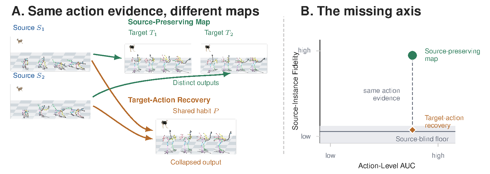

# Why Cross-Skeleton Retargeting Is Non-Identifiable: Structural Limits of Generative Motion Models

Zhiyuan Li, Wenyan Yang, Pekka Marttinen, Joni Pajarinen
Aalto University, Finland

NeurIPS 2026 · [Paper](https://arxiv.org/abs/2609.37297) · [Project page](https://cross-skeleton-retargeting.netlify.app/)



## What we found

Motion retargeting moves an animation from one body to another, for example from a horse to
a robot. When a model trained on many different bodies produces a target motion that shows the
right action, there are two possible explanations: the model carried over what made that
particular source clip different, or it simply produced a typical motion for that action. The
training data cannot tell these apart, and we show that standard training objectives cannot
either.

To make the difference measurable we introduce Source-Instance Fidelity (SIF). With the target
body and the action held fixed, SIF asks whether the outputs differ from one another the way
their source clips do. On 1,891 combinations of source body, target body and action from the
Truebones Zoo, nine of the fourteen methods we evaluate sit at or near the source-blind floor,
the score of a method that ignores its source, including methods that do well on the usual
action-level test. The same pattern holds where true correspondences exist: when human motion
is retargeted to humanoid robots, models trained with the standard objectives lose most of what
made each source clip different, while the same model trained on the true pairs keeps it.

## What is in this repository

| Folder | Contents |
|---|---|
| `sif/` | The SIF toolkit: score any set of retargeted motions. Needs only NumPy. |
| `benchmark/` | The Truebones evaluation sets (1,891, 49 and 37 combinations), scoring, and the action-level test. |
| `methods/` | The fourteen evaluated methods, with training and generation scripts and the settings used in the paper. |
| `robots/` | The two human-to-robot studies (one human to the Unitree G1; LAFAN1 to six humanoid robots). |
| `synthetic/` | The small synthetic setting where the true mapping is known, used to calibrate SIF. |
| `latents/` | The appendix checks on the methods' internal (latent) codes. |
| `core/` | Truebones preprocessing and the AnyTop code several methods build on. |
| `paper/` and `results/` | The saved results (`results/`) and the scripts that rebuild every table and figure of the paper from them (`paper/`). |
| `docs/` | Step-by-step guides. |

## Quick start: score your own retargeted motions

```bash
git clone https://github.com/LiZhYun/NeurIPS2026-Cross-Skeleton-Retargeting.git
cd NeurIPS2026-Cross-Skeleton-Retargeting
pip install -e .
python examples/quickstart.py
```

A group is a few source clips that share a source body and an action, together with the
output your method produced for each of them on one target body. Each clip is an array of joint
positions with shape `(frames, joints, 3)`.

```python
from sif import score_groups

groups = [
    {"sources": [src_1, src_2, src_3], "outputs": [out_1, out_2, out_3], "block": "Horse"},
    # ... more groups
]
result = score_groups(groups, length="both")
print(result["raw"].sif, result["raw"].ci, result["raw"].p)
```

The same from the command line, with the clips stored as `.npy` files and listed in a
`groups.json` file in the format shown in [docs/sif.md](docs/sif.md):

```bash
sif-score groups.json --out results.json
```

SIF is near one when outputs keep the differences between their source clips and near zero
when they ignore them. The toolkit also reports a 95% interval, a shuffle-test p-value, and
how much the outputs vary compared with their sources. See [docs/sif.md](docs/sif.md).

## Reproduce the paper

Create the main environment (Python 3.8, PyTorch 2.4, CUDA 12.1):

```bash
conda env create -f environment.yml
conda activate retargeting-limits
```

Every table and quantitative figure of the paper is rebuilt from the files in `results/`:

```bash
python -m paper.make_tables
python -m paper.make_figures
```

`make_figures` typesets its labels with LaTeX, so `latex`, `dvipng` and `kpsewhich` must be on
your path. To get figures identical to the paper's, use the separate setup in
`paper/requirements-figures.txt`; see [paper/README.md](paper/README.md).

To score a method on the Truebones evaluation, download and preprocess the Truebones Zoo
([docs/data.md](docs/data.md)), generate the method's outputs, then:

```bash
python -m benchmark.score --outputs outputs/<method>/set1891 --set 1891
```

Guides for each part: [training and generating with each method](docs/methods.md),
[the Truebones evaluation](docs/benchmark.md), [the robot studies](docs/robots.md),
[the synthetic calibration](docs/synthetic.md) and [the latent-code checks](docs/latents.md).

## Data and licences

No motion data is included. Each dataset is downloaded from its owner:

- **Truebones Zoo** animal motions, from [Truebones](https://truebones.gumroad.com/l/skZMC).
- **BONES-SEED** human motions and their Unitree G1 versions, from
  [Bones Studio](https://bones.studio/). Training data includes Motion Data by Bones Studio
  (https://bones.studio/). Use of the underlying dataset is subject to the BONES Motion
  Capture Dataset License Agreement.
- **LAFAN1** human motions, from [Ubisoft La Forge](https://github.com/ubisoft/ubisoft-laforge-animation-dataset),
  licensed CC BY-NC-ND 4.0. Nothing made from it is included here.

Code by others is fetched by scripts rather than copied, except the AnyTop code in
`core/anytop/` (MIT). See [THIRD_PARTY.md](THIRD_PARTY.md) for every outside source and its
licence.

## Robot models

We do not distribute the trained robot models. The BONES-SEED licence does not allow sharing
models whose output could stand in for its data. The three human-to-G1 models retrain in about
three minutes on one GPU. On our GPU (an NVIDIA H200) the retrained models give exactly the
outputs reported in the paper; on other hardware small differences are possible
([docs/robots.md](docs/robots.md)).

## Citation

```bibtex
@inproceedings{li2026retargeting,
  title     = {Why Cross-Skeleton Retargeting Is Non-Identifiable: Structural Limits of Generative Motion Models},
  author    = {Li, Zhiyuan and Yang, Wenyan and Marttinen, Pekka and Pajarinen, Joni},
  booktitle = {Advances in Neural Information Processing Systems},
  year      = {2026}
}
```

## Acknowledgements and licence

This work was supported by the Research Council of Finland, Flagship program Finnish Center for
Artificial Intelligence (FCAI), and the Research Council of Finland (357301, 358246). We
acknowledge CSC – IT Center for Science, Finland, for access to the LUMI supercomputer, and the
computational resources provided by the Aalto Science-IT project. Several methods build on
[AnyTop](https://github.com/Anytop2025/Anytop) by Gat et al.

The code in this repository is released under the MIT licence ([LICENSE](LICENSE)).
